# fsopen-part0
Helsinki University [Full Stack Open Course](https://fullstackopen.com/) Part0
# Exercises
## 0.4: New note
In chapter Loading a page containing JavaScript - review the chain of events caused by opening the page https://studies.cs.helsinki.fi/exampleapp/notes is depicted as a sequence diagram

The diagram was made using websequencediagrams service as follows:

Create a similar diagram depicting the situation where the user creates a new note on page https://studies.cs.helsinki.fi/exampleapp/notes when writing something into the text field and clicking the submit button.

If necessary, show operations on the browser or on the server as comments on the diagram.

The diagram does not have to be a sequence diagram. Any sensible way of presenting the events is fine.

All necessary information for doing this, and the next two exercises, can be found from the text of this part. The idea of these exercises is to read the text through once more, and to think through what is going on there. Reading the application code is not necessary, but it is of course possible.

```mermaid
sequenceDiagram
    participant browser
    participant server

    browser->>server: POST [https://studies.cs.helsinki.fi/exampleapp/notes](https://studies.cs.helsinki.fi/exampleapp/new_note)
    activate server
    server-->>browser: 302 Found
    deactivate server
    Note right of server:  The server responds with HTTP status code 302 Found.<br/> This is a URL redirect, with which the server asks the browser<br/> to do a new HTTP GET request to the address defined in<br/> the header´s Location - the address "notes"

    
    browser->>server: GET [https://studies.cs.helsinki.fi/exampleapp/main.css](https://studies.cs.helsinki.fi/exampleapp/notes)
    activate server
    server-->>browser: HTML document
    deactivate server

    browser->>server: GET https://studies.cs.helsinki.fi/exampleapp/main.css
    activate server
    server-->>browser: main.css
    deactivate server

    browser->>server: GET https://studies.cs.helsinki.fi/exampleapp/main.js
    activate server
    server-->>browser: main.js
    deactivate server

    Note right of browser: The browser starts executing the JavaScript code <br/> that requests JSON from the server

    browser->>server: GET https://studies.cs.helsinki.fi/exampleapp/data.json
    activate server
    server-->>browser: [{ "content": "HTML is easy", "date": "2023-1-1" }, ... ]
    deactivate server

    Note right of browser: The browser executes the event handler<br/> that renders the notes to display
    
```

## 0.5: Single page app
Create a diagram depicting the situation where the user goes to the single page app version of the notes app at https://studies.cs.helsinki.fi/exampleapp/spa.

## 0.6: New note SPA
Create a diagram depicting the situation where the user creates a new note using the single page version of the app.

This was the last exercise, and it's time to push your answers to GitHub and mark the exercises as done in the submission application.
